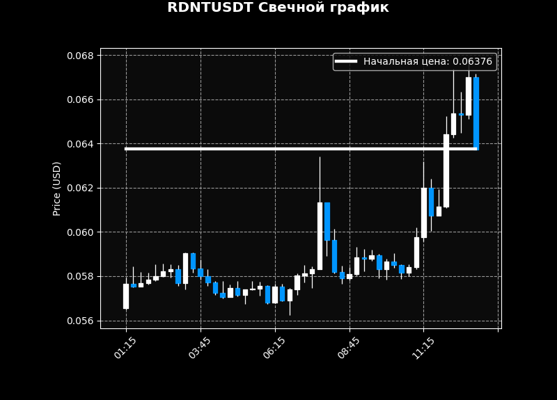

# ProximaTrade

Example scalp script

## START

Rewrite `config.py.exmaple` to `config.py` and write your tokens and sitings in file

## Review

# Hours PNL

The project can count the summary pnl and pnl per hours

# Coin Graph

